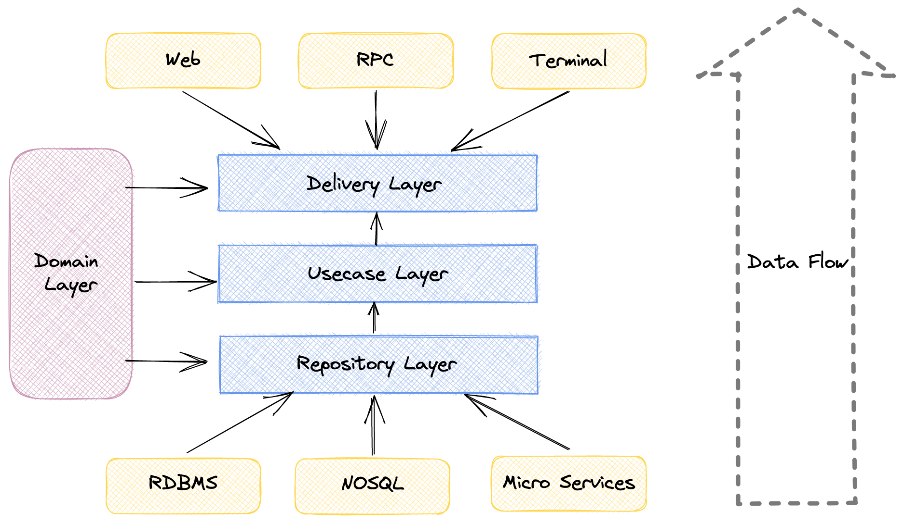

# go-clean-arch
### English | [简体中文](https://github.com/luoshanjie/go-clean-arch/tree/main/doc)
---
## What is Clean Arch
Clean Arch from [Uncle Bob](https://8thlight.com/blog/uncle-bob/2012/08/13/the-clean-architecture.html), Here are some rules:

- Independent of Frameworks
- Testable
- Independent of UI
- Independent of Database
- Independent of any external agency

### Independent of Frameworks
In the actual development process, we will use various frameworks. If our business and frameworks are deeply coupled, it can be very difficult to change frameworks. So we need a pattern to avoid business dependence on frameworks

### Testable
When our business is complex, testing will depend on outside input. It would be difficult to test a single component or business independently because the inputs and outputs are heavily dependent on other components. So we need to be testable

### Independent of UI
The UI is often modified, not only by elements that the user manipulates, but also by changing the display directly. For example, the Web interface can be modified to a command console interface

### Independent of Database
Data storage sources also change as the business changes. We started with SQLite, then we switched to Access, and finally we switched to MySQL/PostgreSQL

### Independent of any external agency
Our business needs to focus on the business itself and not be eroded by outsiders

## Clean Arch
When we use clean arch, we can layer in this way:
1. Domain Layer
2. Delivery Layer
3. Usecase Layer
4. Repository Layer
### Diagram

## Don't use Clean Arch
If we don't use clean arch, Code becomes difficult to maintain as it becomes more functional. The best practice is not to use Clean Arch, and then as functionality increases, the code becomes decayed and difficult to maintain. The Clean Arch approach was then used for refactoring, making it easy to maintain and extend  

## Best practices
### First Target
We will complete a simple functional Web service that will have the following capabilities
1. Add a user through interface (http://localhost/api/v1/user/add)
2. Modify user information through interface (http://localhost/api/v1/user/:id/update)
3. Search user information through interface (http://localhost/api/v1/user/:id/select)
4. Delete a user through interface (http://localhost/api/v1/user/:id/delete)

### Quick Finish
We did this quickly and without using Clean Arch: [lesson_one](https://github.com/luoshanjie/go-clean-arch/raw/main/lesson_one)

## Thanks
bxcodec's project inspired me a lot(https://github.com/bxcodec/go-clean-arch), and I'd like to thank Uncle Bob for bringing us such a beautiful design. Thank you Uncle Bob and Bxcodec ^_^
